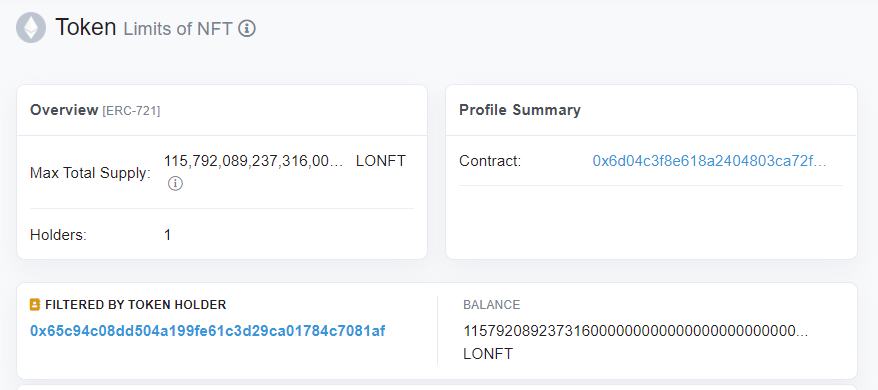
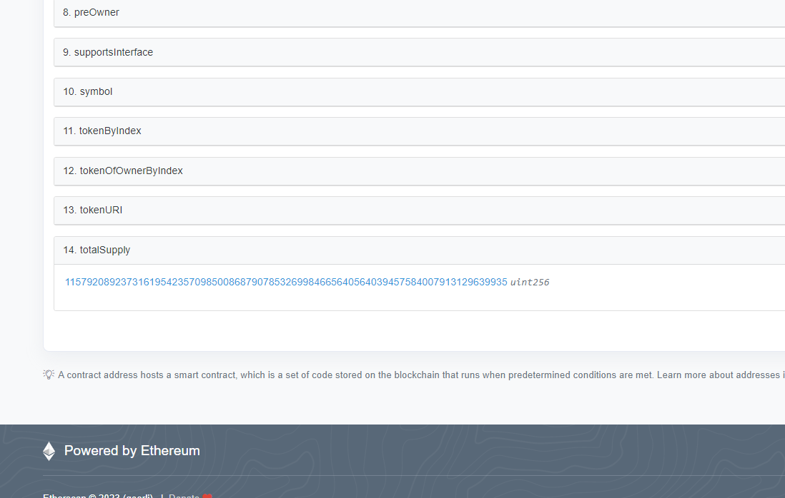
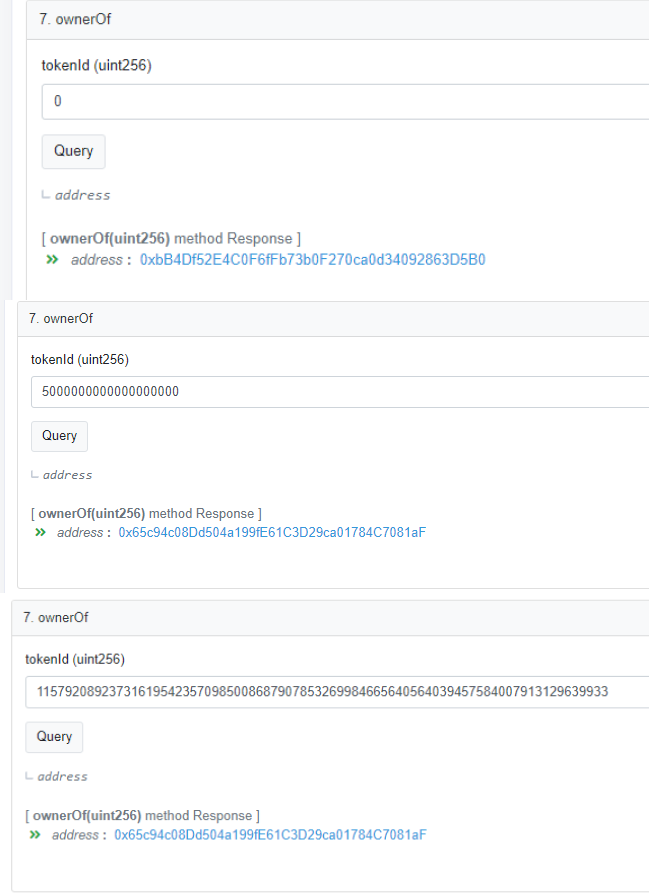
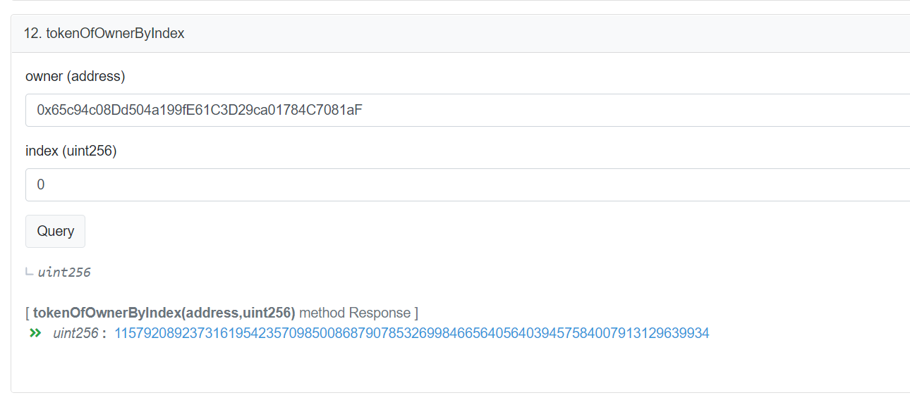
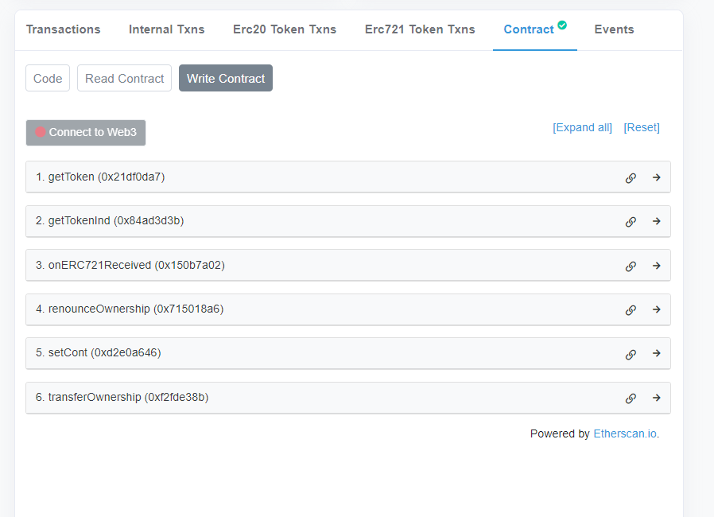
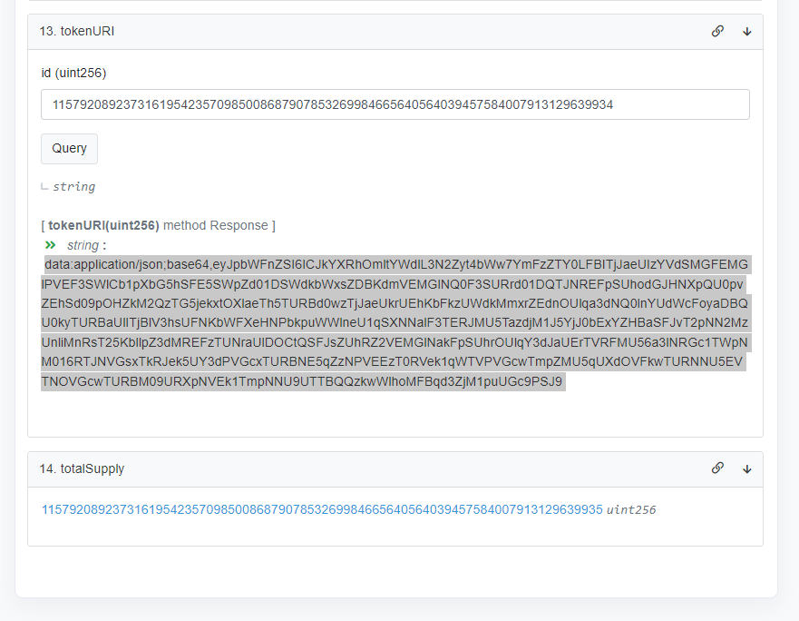
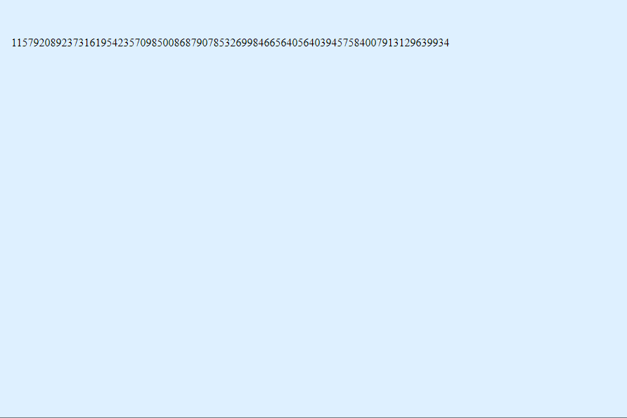

# Limits of NFT(ERC721) or Minting 2^256 - 1 NFT
## warnig:
 these contract have been altered for proof of concept and they are diffrent than the proposed Implementation. please see this [link](https://ethereum-magicians.org/t/use-zero-gas-0-gwei-for-minting-any-number-of-nft/12403) to learn more about mechanism and rationale 
## Abstract
The upper limit of `totalSupply` of any ERC721 contract or how many NFT can be minted, is determined by the EIP-721 is `uint256` number.

a quote from [EIP-721](https://eips.ethereum.org/EIPS/eip-721#rationale):

>NFT Identifiers </br>Every NFT is identified by a unique uint256 ID inside the ERC-721 smart contract. 

```
interface ERC721Enumerable
    
    function totalSupply() external view returns (uint256);
```
and `uint256` is an *unsigned* (it means numbers equal to zero or greater) integer number, with 256 bit. and the range of uint256 is integer number from 0 ~ 2**256 -1.

so the upper limit for totalSupply is this number:
115792089237316195423570985008687907853269984665640564039457584007913129639935

In my Implementation proposal I've talked about how this can be reached:

[see the implementation here](https://ethereum-magicians.org/t/eip-draft-mint-arbitrary-number-of-tokens-erc-721-via-eip-2309/11589)

## See the project in Action:

I've deployed a contract on goerli for proof of concept.

goerli Limits of NFT: [0x6d04C3F8e618a2404803Ca72f5dF93f4F50CaD45](https://goerli.etherscan.io/token/0x6d04c3f8e618a2404803ca72f5df93f4f50cad45)



this token is Fully IERC721 and IERC721Enumerable compatible.
I highly recomnd you try it for yourself.



from blanceOf() to ownerOf()



even tokenOfOwnerbyIndex().



## try it for yourself

All of these tokens are minted to "giver" contract that you can grab one for yourself.


1. by calling the getToken() you will get a token from index of `0` of the preOwner(giver address).
2. by calling the getTokenInd(Index) you will get a token from index of `Index` of the preOwner(giver address).

giver goerli : [0x65c94c08Dd504a199fE61C3D29ca01784C7081aF](https://goerli.etherscan.io/address/0x65c94c08dd504a199fe61c3d29ca01784c7081af#writeContract)

### URI:

for proof of concept this contract have an SVG Image with tokenId on it.



the Image:




## conclusion:
this project shows:
1. limit of uint256 for totalSupply for ERC721 can be reached.
2. zero transaction minting is possible.
3. batch minting via EIP-2309 and IERC721Enumerable is possible.


### please join the disscussion:

[Ethereum magician: Use zero gas(0 gwei) for minting any number of NFT](https://ethereum-magicians.org/t/use-zero-gas-0-gwei-for-minting-any-number-of-nft/12403)